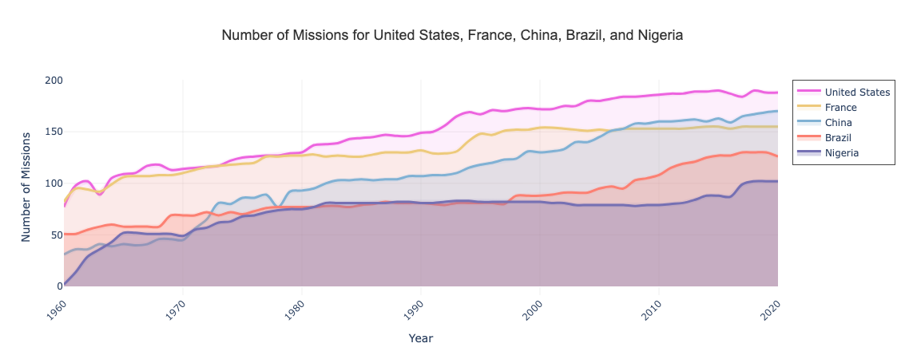

# Global-Diplomacy-ABM
Global-Diplomacy-ABM is an agent-based simulation that models the evolution of international diplomatic relations using historical data from 1960 to 2020. The project leverages network science and computational modeling to explore how alliances form, evolve, and dissolve over time, providing insights into the dynamics of global diplomacy.

## Exploratory Data Analysis

Let's take a look at the number of missions to each country. The following choropleth map shows the average number of missions to a given region over all time. 

As you can see, there are less missions targeted at the United States and Oceania (Australia). Similarly, the following histogram confirms this idea. 

We can also evaluate this on a country level, rather than just looking at the regions. The plot below shows this information for Italy, for example. This plot not only shows the total number of visits in a given year, but also the breakdown of the different types of missions. 

Consider the following plot that demonstrates the number of missions to five different countries over time. 

Another consideration is the level of representation for each country, or how connected they are with others in terms of diplomacy. 

